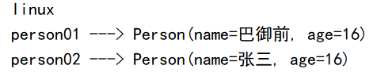

# Spring ADD(注解驱动开发)

> 基于 Spring4.3.12

# 第一章 容器

## **1.1 组件注册**

> 源码：src/01_register-bean
>
> ​	- test 目录下为对应的测试代码

### 一、注解开发

#### 1) @Configuration

- 概念：告诉 Spring 这是一个配置类(配置文件)

#### 2) @Bean

- 概念：在容器中配置一个 bean 实例

- 使用
  - 类型为返回值类型，id 默认为方法名
  - 可以指定**注解的 value 值** 为对应的 id 

- 实例

  ```java
  @Bean
  public Person person(){...};
  ```

#### 3) @ComponentScan 

- 概念：开启组件扫描

- 使用

  - value：扫描指定包下带有 @Controller、@Service、@Repository、@Component

    注解的组件并注册对应的 bean 实例，id 默认为类名(首字母小写)

  - excludeFilters: 指定一个或多个 `@Filter`，过滤指定的组件

    - `@Filter`：配置过滤条件

      - type：过滤规则，值为 FilterType 枚举类实例

        | ANNOTATION      | 根据注解来排除                                               |
        | --------------- | ------------------------------------------------------------ |
        | ASSIGNABLE_TYPE | 根据类类型来排除                                             |
        | ASPECTJ         | 根据AspectJ表达式来排除                                      |
        | REGEX           | 根据正则表达式来排除                                         |
        | CUSTOM          | 自定义FilterClass排除，需要实现`org.springframework.core.type.filter.TypeFilter`接口 |

      - classes：对应的实例类型

      - 实例

        ```java
        @ComponentScan(basePackages = "pers.dreamer07.springAoon", excludeFilters = {
            @Filter(type = FilterType.ANNOTATION, classes = Controller.class),
            @Filter(type = FilterType.ASSIGNABLE_TYPE, classes = SpringAoonApplication.class)
        })
        public class MainConfig
        ```

  - includeFilters：指定一个/多个 @Filter，只包含指定改的组件

    - `@Filter` 和上面的一样

    - 还需要设置当前 `@ComponentScan` 注解的 useDefaultFilters 属性为 false(关闭默认的过滤规则)

    - 实例

      ```java
      @ComponentScan(basePackages = "pers.dreamer07.springAoon",
      	// 排除指定的组件
          // 只包含指定的组件, 还需要设置 useDefaultFilters 属性为 false(关闭默认的过滤规则)
          useDefaultFilters = false,
          includeFilters = {
              @Filter(type = FilterType.ANNOTATION, classes = Controller.class),
              @Filter(type = FilterType.ASSIGNABLE_TYPE, classes = SpringAoonApplication.class)
          }
      )
      public class MainConfig 
      ```

  - useDefaultFilters：是否使用默认的过滤规则，默认为 true

- **注意**：

  1. 如果是 JDK8，则可以配置多个 `@ComponentScan`

     如果不是 JDK8，则可以使用 `@ComponentScans`, 在其中配置 value 值为多个 `@ComponentScan`

  2. 如果类 A 使用 excludeFilters ，在组件扫描时，如果发现类 B 的 `@ComponentScan` 注解**没有定义一样的排除规则**时，类 A，B 的排除规则都不会生效

     可以额外添加一个 `@Filter` 排除类 B 即可

- **拓展**

  1. 实现 TypeFilter 接口，自定义过滤规则

     ```java
     /**
      * 自定义过滤规则
      * @author EMTKnight
      * @create 2021-02-24
      */
     public class MyTypeFilter implements TypeFilter {
     
         /**
          * 过滤时调用的方法，
          * @param metadataReader 当前正在扫描的类
          * @param metadataReaderFactory 工厂类，可以获取其他类
          * @return 根据 (exclude / include) 不同而不同，返回 true 表示(不需要/需要)，false 表示(需要/不需要)
          * @throws IOException
          */
         @Override
         public boolean match(MetadataReader metadataReader, MetadataReaderFactory metadataReaderFactory) throws IOException {
             /* metadataReader
             * 获取当前类使用的注解：metadataReader.getAnnotationMetadata();
             * 获取当前类的信息(父类，实现接口等)：metadataReader.getClassMetadata();
             * 获取当前类的资源(类的路径等)：metadataReader.getResource();
             * */
             System.out.println("当前类类名：" + metadataReader.getClassMetadata().getClassName());
             // 过滤规则：判断当前类的父类名是否包含 controller
             if(Objects.requireNonNull(metadataReader.getClassMetadata().getSuperClassName()).contains("Object") ){
                 System.out.println("当前类父类名：" + metadataReader.getClassMetadata().getSuperClassName());
                 return true;
             }
             return false;
         }
     
     }
     ```

     使用

     ```java
     @ComponentScan(basePackages = "pers.dreamer07.springAoon",
             // 排除指定的组件
             excludeFilters = {
                 @Filter(type=FilterType.CUSTOM, classes = {MyTypeFilter.class})
             }
     )
     public class MainConfig
     ```

#### 4) @Scope

- 概念：调整组件(bean实例)的作用域

- 使用 
  - value 可取值
    1. singleton：单实例(默认值)，在 IOC 容器创建时创建
    2. prototype：多实例，在获取对应的 bean 实例时创建
    3. request(不常用)：在同一次请求内创建一次
    4. session(不常用)：在同一次会话内创建一次

- 实例

  ```java
  @Bean("person01")
  @Scope("prototype")
  public Person person(){
      System.out.println("person 实例创建");
      return new Person("巴御前",16);
  }
  ...
  // 测试代码
  @Test
  public void test03(){
      ApplicationContext context = new AnnotationConfigApplicationContext(MainConfig.class);
      // 如果是 scope.value = singleton,那么 person 实例的创建将快于 62 行输出
      System.out.println("ioc 容器创建完成");
      Object person = context.getBean("person01");
      Object person2 = context.getBean("person01");
      System.out.println(person == person2); // singleton：true; prototype: false
  }
  ```

#### 5) @Lazy 

- 概念：懒加载 - 针对于单实例使用，在第一次获取 bean 实例时创建对应的 bean 实例

#### 6) @Condtional

- 作用范围

  1. 类上：只有满足相应的条件，这个类中的所有 bean 注册才会生效
  2. 方法上：只有满足相应的条件，才会注册对应的 bean 实例

- 使用

  - value 值：接收一个/多个实现了 **Condition** 接口的实现类
  - **Condition** 接口：条件接口，含有抽象方法 matches()，该方法如果返回 true 代表条件满足，反之相反

- **实例**

  1. 根据需求，实现 Condition 接口，完成对应的 matches() 方法的逻辑设计

     ```java
     // WindowCondition 实现类，判断运行环境是否为 windows
     public class WindowCondition implements Condition {
     
         /**
          * 判断条件的主执行方法
          * @param context 判断条件时的上下文环境
          * @param metadata 注释信息
          * @return 返回 true 代表条件满足，反之相反
          */
         @Override
         public boolean matches(ConditionContext context, AnnotatedTypeMetadata metadata) {
             /* ConditionContext context 方法
             *   getBeanFactory(); 可以获取 ioc 容器使用的 bean Factory
             *   getClassLoader(); 可以获取类加载器
             *   getEnvironment(); 可以获取运行时的环境
             *   getRegistry(); 可以获取 bean 定义的注册类(可以实现对注册 bean 的增删查改)
             * */
             Environment environment = context.getEnvironment();
             String osName = environment.getProperty("os.name");
             return osName != null && osName.contains("Windows");
         }
     }
     
     ...
         
     // LinuxCondition 实现类：判断运行环境是否为 linux
     public class WindowCondition implements Condition {
     
         @Override
         public boolean matches(ConditionContext context, AnnotatedTypeMetadata metadata) {
             ...
             return osName != null && osName.contains("linux");
         }
     }
     ```

  2. 在注册 bean 的方法/类上的 `@Conditional` 注解中使用

     ```java
     // 方法上
     @Conditional({LinuxCondition.class})
     @Bean
     public Person person02(){
         return new Person("张三", 16);
     };
     
     @Conditional(WindowCondition.class)
     @Bean
     public Person person03(){
         return new Person("李四", 20);
     }
     
     // 类上
     @Conditional(WindowCondtion.class)
     public class MainConfig{}
     ```

  3. 测试

     ```java
     @Test
     public void test04(){
         // getBeansOfType(Class)：可以获取容器中指定类型的 bean 实例和 id 组成的 Map
         Map<String, Person> personMap = context.getBeansOfType(Person.class);
     
         // getEnvironment()：获取当前容器运行的环境信息对象(Environment)
         Environment environment = context.getEnvironment();
         // environment.getProperty("key")：根据 key 获取对应的环境信息
         String osName = environment.getProperty("os.name"); // os,name -> 运行时的操作系统
         System.out.println(osName); 
     
         for (String name : personMap.keySet()) {
             System.out.println(name + " ---> " + personMap.get(name));
         }
     }
     ```

     

- 扩展

  - 修改 IDEA 的运行参数：https://blog.csdn.net/oz965557340/article/details/78165693

#### 7) @Import 

- 概念：快速导入组件

- 使用(针对 value 值)

  1. 直接传入对应的组件的 Class
  2. 传入一个 **ImportSelector** 接口的实现类，该接口的抽象方法 selectImports() 需要返回需要导入组件的全类名构成的字符串数组
  3. 传入一个 **ImportBeanDefinitionRegistrar** 接口的实现类，可以手动注册定义逻辑注册对应的 bean 实例

- **注意**：使用 @Import 注解导入的组件，id 为对应的全类名

- 实例：

  1. 设计对应的实现类

     ```java
     // 设计实现 ImportSelector 接口的实现类
     public class MyImportSelector implements ImportSelector {
     
         /**
          *
          * @param importingClassMetadata 当前使用了 @Import 注解的组件的其他注解的信息
          * @return 返回需要导入的组件的全类名构成的字符串数组
          */
         @Override
         public String[] selectImports(AnnotationMetadata importingClassMetadata) {
             for (String type : importingClassMetadata.getAnnotationTypes()) {
                 System.out.println("其他注解信息:" + type);
             }
     
             return new String[]{
                 "pers.dreamer07.springAoon.bean.Servant",
                 "pers.dreamer07.springAoon.bean.Master"
             };
         }
     
     }
     
     ...
     
     // 设计实现 ImportBeanDefinitionRegistrar 接口的实现类
     public class MyImportBeanDefinitionRegistrar implements ImportBeanDefinitionRegistrar {
     
         /**
          * 手动设计处理逻辑并注册对应的 bean
          * @param importingClassMetadata 使用 @Import 注解的类的注解信息
          * @param registry 管理 bean 注册的对象
          */
         @Override
         public void registerBeanDefinitions(AnnotationMetadata importingClassMetadata, BeanDefinitionRegistry registry) {
             // containsBeanDefinition("beanId"): 判断注册的 bean 中是否有对应 id 的 bean 实例，有返回 true，反之相反
             boolean isContains1 = registry.containsBeanDefinition("person01");
             boolean isContains2 = registry.containsBeanDefinition("person03");
             // 如果存在相应的 bean 实例就手动注册一个 bean
             if(isContains1 && isContains2){
                 // RootBeanDefinition 是 BeanDefinition 的实现类(可以指定 bean 的作用域等信息)
                 RootBeanDefinition beanDefinition = new RootBeanDefinition(Person.class);
                 // registerBeanDefinition("beanId", BeanDefinition beanDefinition(bean 实例描述对象))：注册一个 bean 实例，并指定 id 和对应的 bean 实例描述对象
                 registry.registerBeanDefinition("巴御前",beanDefinition);
             }
         }
     }
     ```

  2. 使用 `@Import` 注解导入组件

     ```java
     // @Import: 快速给容器中导入一个/多个组件
     @Import({Person.class, MyImportSelector.class, MyImportBeanDefinitionRegistrar.class})
     ```

  3. 测试，打印 bean 实例 id 即可

### **二、扩展类**

#### 1) AnnotationConfigApplicationContext：

- 概念：ApplicationContext 接口的实现类，用于创建配置类的 IOC 容器对象

- 方法

  1. getBean(Class)：传入 Class 类型获取对应的 bean 实例
  2. getBeanNamesForType(Class)：传入 Class 类型获取 IOC 容器中所有对应的 bean 实例的 id
  3. getBeanDefinitionNames()：获取当前 IOC 容器对象中所有 bean 实例的 id
  4. getBeansForType(Class)：可以获取容器中指定类型(Class)的 bean 实例和 id 组成的 Map
  5. getEnvironment()：获取当前容器运行的环境信息对象(Environment)

- 实例

  ```java
  // 1. 调用 AnnotationConfigApplicationContext 的构造函数，创建配置类，创建 ApplicationContext 类对象
  ApplicationContext applicationContext = new AnnotationConfigApplicationContext(MainConfig.class);
  
  // 2. 方法调用
  // 2.1 通过 getBean(Class) 传入 Class 类型获取对应的 bean 实例
  Person person = applicationContext.getBean(Person.class);
  // 2.2 通过 getBeanNamesForType(Class) 传入 Class 类型获取 IOC 容器中所有对应的 bean 实例的 id
  String[] names = applicationContext.getBeanNamesForType(Person.class);
  // 2.3 通过 getBeanDefinitionNames() 获取 IOC 容器中所有 bean 实例的 id
  String[] beanDefinitionNames = context.getBeanDefinitionNames();
  // 2.4 getBeansOfType(Class)：可以获取容器中指定类型的 bean 实例和 id 组成的 Map
  Map<String, Person> personMap = context.getBeansOfType(Person.class);
  // 2.5 getEnvironment()：获取当前容器运行的环境信息对象(Environment)
  Environment environment = context.getEnvironment();
  
  // 3. 输出测试
  log.info(person.toString()); // Person(name=巴御前, age=16)
  for (String name : names) {
      System.out.println(name); // person
  }
  ```

#### 2) Environment

- 概念：Spring IOC 容器的运行环境

- 方法：

  1. getProperty("key")：根据 key 获取对应的环境信息

- 实例

  ```java
  // getEnvironment()：获取当前容器运行的环境信息对象(Environment)
  Environment environment = context.getEnvironment();
  // environment.getProperty("key")：根据 key 获取对应的环境信息
  String osName = environment.getProperty("os.name"); // os,name -> 运行时的操作系统
  System.out.println(osName); // Windows 10
  ```

#### 3) FactoryBean

- 概念：接口，也是一个 Bean，用户可以通过实现该接口用于定制实例化 Bean 的逻辑

- 使用：

  1. getObject(): FactoryBean 会将该方法的返回结果作为 bean 实例装配到 IOC 容器中
  2. getObjectType(): 获取对应的 bean 实例的类型
  3. isSingleton(): 是否单例，返回 true 则是，反之相反

- 实例：

  1. 实现 FactoryBean 接口

     ```java
     /**
      * 通过实现 Factory 用于控制 Person bean 的实例化
      * @author EMTKnight
      * @create 2021-02-26
      */
     public class PersonFactoryBean implements FactoryBean<Person> {
     
         /**
          * 该方法的返回结果会作为 bean 实例装配到 IOC 容器中
          * @return
          * @throws Exception
          */
         @Override
         public Person getObject() throws Exception {
             return new Person("巴御前",17);
         }
     
         @Override
         public Class<?> getObjectType() {
             return Person.class;
         }
     
         @Override
         public boolean isSingleton() {
             return false;
         }
     }
     ```

  2. 使用 @Bean 配置 FactoryBean

  3. 测试

     ```java
     @Test
     public void test06(){
         Person person = context.getBean("personFactoryBean", Person.class);
         // 通过注册 FactoryBean 实例时使用的 id 得到的是其通过 getObject() 方法返回的 bean 实例
         System.out.println(person); // Person(name=巴御前, age=17)
         // 如果需要获取的是 FactoryBean 实例，可以在 id 前面加上 &
         Object bean = context.getBean("&personFactoryBean");
         System.out.println(bean); // pers.dreamer07.springAoon.bean.PersonFactoryBean@1532c619
     }
     ```

- 注意：

  1. 通过注册 FactoryBean 的 id 在 IOC 容器中默认获取的是其 getObject() 方法返回后装配的 bean 实例
  2. 如果需要获取 FactoryBean 实例，可以在对应的 id 前加上 **&** 即可

  

### 三、总结

1. 对应自定义的组件：包扫描+组件注解(@Controller/@Service/@Repository/@Component)
2. 对应第三方的组件：使用 @Bean 进行注册
3. 快速给容器中导入一个 bean：使用 @Import 注解
4. 使用 Spring 提供的 FactoryBean(工厂 Bean)

# 第二章 扩展原理

# 第三章 web

