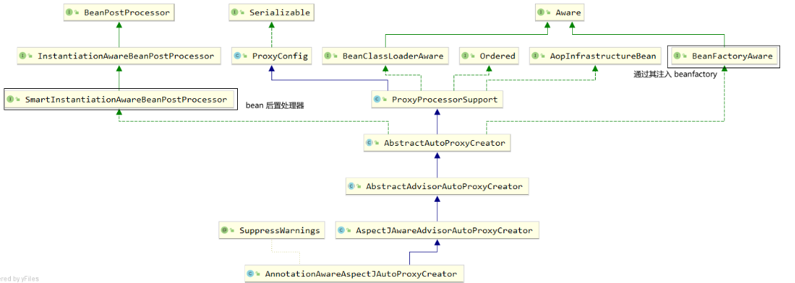
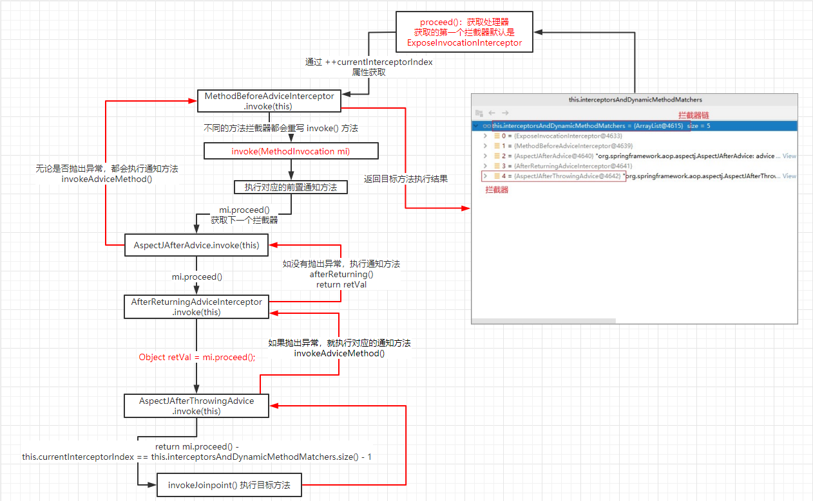

# Spring ADD(注解驱动开发)

> 基于 Spring4.3.12

# 第一章 容器

## **1.1 组件注册**

> 源码：src/01_register-bean
>
> ​	- test 目录下为对应的测试代码

### 一、注解开发

#### 1) @Configuration 

- 概念：告诉 Spring 这是一个配置类(配置文件)

#### 2) @Bean

- 概念：在容器中配置一个 bean 实例

- 使用
  - 类型为返回值类型，id 默认为方法名
  - 可以指定**注解的 value 值** 为对应的 id 
- 标注的方法中使用的参数都会从 IOC 容器中获取
  
- 实例

  ```java
  @Bean
  public Person person(){...};
  ```

#### 3) @ComponentScan 

- 概念：开启组件扫描

- 使用

  - value：扫描指定包下带有 @Controller、@Service、@Repository、@Component

    注解的组件并注册对应的 bean 实例，id 默认为类名(首字母小写)

  - excludeFilters: 指定一个或多个 `@Filter`，过滤指定的组件

    - `@Filter`：配置过滤条件

      - type：过滤规则，值为 FilterType 枚举类实例

        | ANNOTATION      | 根据注解来排除                                               |
        | --------------- | ------------------------------------------------------------ |
        | ASSIGNABLE_TYPE | 根据类类型来排除                                             |
        | ASPECTJ         | 根据AspectJ表达式来排除                                      |
        | REGEX           | 根据正则表达式来排除                                         |
        | CUSTOM          | 自定义FilterClass排除，需要实现`org.springframework.core.type.filter.TypeFilter`接口 |

      - classes：对应的实例类型

      - 实例

        ```java
        @ComponentScan(basePackages = "pers.dreamer07.springAoon", excludeFilters = {
            @Filter(type = FilterType.ANNOTATION, classes = Controller.class),
            @Filter(type = FilterType.ASSIGNABLE_TYPE, classes = SpringAoonApplication.class)
        })
        public class MainConfig
        ```

  - includeFilters：指定一个/多个 @Filter，只包含指定改的组件

    - `@Filter` 和上面的一样

    - 还需要设置当前 `@ComponentScan` 注解的 useDefaultFilters 属性为 false(关闭默认的过滤规则)

    - 实例

      ```java
      @ComponentScan(basePackages = "pers.dreamer07.springAoon",
      	// 排除指定的组件
          // 只包含指定的组件, 还需要设置 useDefaultFilters 属性为 false(关闭默认的过滤规则)
          useDefaultFilters = false,
          includeFilters = {
              @Filter(type = FilterType.ANNOTATION, classes = Controller.class),
              @Filter(type = FilterType.ASSIGNABLE_TYPE, classes = SpringAoonApplication.class)
          }
      )
      public class MainConfig 
      ```

  - useDefaultFilters：是否使用默认的过滤规则，默认为 true

- **注意**：

  1. 如果是 JDK8，则可以配置多个 `@ComponentScan`

     如果不是 JDK8，则可以使用 `@ComponentScans`, 在其中配置 value 值为多个 `@ComponentScan`

  2. 如果类 A 使用 excludeFilters ，在组件扫描时，如果发现类 B 的 `@ComponentScan` 注解**没有定义一样的排除规则**时，类 A，B 的排除规则都不会生效

     可以额外添加一个 `@Filter` 排除类 B 即可
     
  3. # **拓展**

  4. 实现 TypeFilter 接口，自定义过滤规则

     ```java
     /**
      * 自定义过滤规则
      * @author EMTKnight
      * @create 2021-02-24
      */
     public class MyTypeFilter implements TypeFilter {
     
         /**
          * 过滤时调用的方法，
          * @param metadataReader 当前正在扫描的类
          * @param metadataReaderFactory 工厂类，可以获取其他类
          * @return 根据 (exclude / include) 不同而不同，返回 true 表示(不需要/需要)，false 表示(需要/不需要)
          * @throws IOException
          */
         @Override
         public boolean match(MetadataReader metadataReader, MetadataReaderFactory metadataReaderFactory) throws IOException {
             /* metadataReader
             * 获取当前类使用的注解：metadataReader.getAnnotationMetadata();
             * 获取当前类的信息(父类，实现接口等)：metadataReader.getClassMetadata();
             * 获取当前类的资源(类的路径等)：metadataReader.getResource();
             * */
             System.out.println("当前类类名：" + metadataReader.getClassMetadata().getClassName());
             // 过滤规则：判断当前类的父类名是否包含 controller
             if(Objects.requireNonNull(metadataReader.getClassMetadata().getSuperClassName()).contains("Object") ){
                 System.out.println("当前类父类名：" + metadataReader.getClassMetadata().getSuperClassName());
                 return true;
             }
             return false;
         }
     
     }
     ```

     使用

     ```java
     @ComponentScan(basePackages = "pers.dreamer07.springAoon",
             // 排除指定的组件
             excludeFilters = {
                 @Filter(type=FilterType.CUSTOM, classes = {MyTypeFilter.class})
             }
     )
     public class MainConfig
     ```

#### 4) @Scope

- 概念：调整组件(bean实例)的作用域

- 使用 
  - value 可取值
    1. singleton：单实例(默认值)，在 IOC 容器创建时创建
    2. prototype：多实例，在获取对应的 bean 实例时创建
    3. request(不常用)：在同一次请求内创建一次
    4. session(不常用)：在同一次会话内创建一次

- 实例

  ```java
  @Bean("person01")
  @Scope("prototype")
  public Person person(){
      System.out.println("person 实例创建");
      return new Person("巴御前",16);
  }
  ...
  // 测试代码
  @Test
  public void test03(){
      ApplicationContext context = new AnnotationConfigApplicationContext(MainConfig.class);
      // 如果是 scope.value = singleton,那么 person 实例的创建将快于 62 行输出
      System.out.println("ioc 容器创建完成");
      Object person = context.getBean("person01");
      Object person2 = context.getBean("person01");
      System.out.println(person == person2); // singleton：true; prototype: false
  }
  ```

#### 5) @Lazy 

- 概念：懒加载 - 针对于单实例使用，在第一次获取 bean 实例时创建对应的 bean 实例

#### 6) @Condtional

- 作用范围

  1. 类上：只有满足相应的条件，这个类中的所有 bean 注册才会生效
  2. 方法上：只有满足相应的条件，才会注册对应的 bean 实例

- 使用

  - value 值：接收一个/多个实现了 **Condition** 接口的实现类
  - **Condition** 接口：条件接口，含有抽象方法 matches()，该方法如果返回 true 代表条件满足，反之相反

- **实例**

  1. 根据需求，实现 Condition 接口，完成对应的 matches() 方法的逻辑设计

     ```java
     // WindowCondition 实现类，判断运行环境是否为 windows
     public class WindowCondition implements Condition {
     
         /**
          * 判断条件的主执行方法
          * @param context 判断条件时的上下文环境
          * @param metadata 注解信息
          * @return 返回 true 代表条件满足，反之相反
          */
         @Override
         public boolean matches(ConditionContext context, AnnotatedTypeMetadata metadata) {
             /* ConditionContext context 方法：
             *   getBeanFactory(); 可以获取 ioc 容器使用的 bean Factory
             *   getClassLoader(); 可以获取类加载器
             *   getEnvironment(); 可以获取运行时的环境
             *   getRegistry(); 可以获取 bean 定义的注册类(可以实现对注册 bean 的增删查改)
             * */
             Environment environment = context.getEnvironment();
             String osName = environment.getProperty("os.name");
             return osName != null && osName.contains("Windows");
         }
     }
     
     ...
         
     // LinuxCondition 实现类：判断运行环境是否为 linux
     public class WindowCondition implements Condition {
     
         @Override
         public boolean matches(ConditionContext context, AnnotatedTypeMetadata metadata) {
             ...
             return osName != null && osName.contains("linux");
         }
     }
     ```

  2. 在注册 bean 的方法/类上的 `@Conditional` 注解中使用

     ```java
     // 方法上
     @Conditional({LinuxCondition.class})
     @Bean
     public Person person02(){
         return new Person("张三", 16);
     };
     
     @Conditional(WindowCondition.class)
     @Bean
     public Person person03(){
         return new Person("李四", 20);
     }
     
     // 类上
     @Conditional(WindowCondtion.class)
     public class MainConfig{}
     ```

  3. 测试

     ```java
     @Test
     public void test04(){
         // getBeansOfType(Class)：可以获取容器中指定类型的 bean 实例和 id 组成的 Map
         Map<String, Person> personMap = context.getBeansOfType(Person.class);
     
         // getEnvironment()：获取当前容器运行的环境信息对象(Environment)
         Environment environment = context.getEnvironment();
         // environment.getProperty("key")：根据 key 获取对应的环境信息
         String osName = environment.getProperty("os.name"); // os,name -> 运行时的操作系统
         System.out.println(osName); 
     
         for (String name : personMap.keySet()) {
             System.out.println(name + " ---> " + personMap.get(name));
         }
     }
     ```

     

- 扩展

  - 修改 IDEA 的运行参数：https://blog.csdn.net/oz965557340/article/details/78165693

#### 7) @Import 

- 概念：快速导入组件

- 使用(针对 value 值)

  1. 直接传入对应的组件的 Class
  2. 传入一个 **ImportSelector** 接口的实现类，该接口的抽象方法 selectImports() 需要返回需要导入组件的全类名构成的字符串数组
  3. 传入一个 **ImportBeanDefinitionRegistrar** 接口的实现类，可以手动注册定义逻辑注册对应的 bean 实例

- **注意**：使用 @Import 注解导入的组件，id 为对应的全类名

- 实例：

  1. 设计对应的实现类

     ```java
     // 设计实现 ImportSelector 接口的实现类
     public class MyImportSelector implements ImportSelector {
     
         /**
          *
          * @param importingClassMetadata 当前使用了 @Import 注解的组件的其他注解的信息
          * @return 返回需要导入的组件的全类名构成的字符串数组
          */
         @Override
         public String[] selectImports(AnnotationMetadata importingClassMetadata) {
             for (String type : importingClassMetadata.getAnnotationTypes()) {
                 System.out.println("其他注解信息:" + type);
             }
     
             return new String[]{
                 "pers.dreamer07.springAoon.bean.Servant",
                 "pers.dreamer07.springAoon.bean.Master"
             };
         }
     
     }
     
     ...
     
     // 设计实现 ImportBeanDefinitionRegistrar 接口的实现类
     public class MyImportBeanDefinitionRegistrar implements ImportBeanDefinitionRegistrar {
     
         /**
          * 手动设计处理逻辑并注册对应的 bean
          * @param importingClassMetadata 使用 @Import 注解的类的注解信息
          * @param registry 管理 bean 注册的对象
          */
         @Override
         public void registerBeanDefinitions(AnnotationMetadata importingClassMetadata, BeanDefinitionRegistry registry) {
             // containsBeanDefinition("beanId"): 判断注册的 bean 中是否有对应 id 的 bean 实例，有返回 true，反之相反
             boolean isContains1 = registry.containsBeanDefinition("person01");
             boolean isContains2 = registry.containsBeanDefinition("person03");
             // 如果存在相应的 bean 实例就手动注册一个 bean
             if(isContains1 && isContains2){
                 // RootBeanDefinition 是 BeanDefinition 的实现类(可以指定 bean 的作用域等信息)
                 RootBeanDefinition beanDefinition = new RootBeanDefinition(Person.class);
                 // registerBeanDefinition("beanId", BeanDefinition beanDefinition(bean 实例描述对象))：注册一个 bean 实例，并指定 id 和对应的 bean 实例描述对象
                 registry.registerBeanDefinition("巴御前",beanDefinition);
             }
         }
     }
     ```

  2. 使用 `@Import` 注解导入组件

     ```java
     // @Import: 快速给容器中导入一个/多个组件
     @Import({Person.class, MyImportSelector.class, MyImportBeanDefinitionRegistrar.class})
     ```

  3. 测试，打印 bean 实例 id 即可

### **二、扩展类**

#### 1) AnnotationConfigApplicationContext：

- 概念：ApplicationContext 接口的实现类，用于创建配置类的 IOC 容器对象

- 方法

  1. getBean(Class)：传入 Class 类型获取对应的 bean 实例
  2. getBeanNamesForType(Class)：传入 Class 类型获取 IOC 容器中所有对应的 bean 实例的 id
  3. getBeanDefinitionNames()：获取当前 IOC 容器对象中所有 bean 实例的 id
  4. getBeansForType(Class)：可以获取容器中指定类型(Class)的 bean 实例和 id 组成的 Map
  5. getEnvironment()：获取当前容器运行的环境信息对象(Environment)

- 实例

  ```java
  // 1. 调用 AnnotationConfigApplicationContext 的构造函数，创建配置类，创建 ApplicationContext 类对象
  ApplicationContext applicationContext = new AnnotationConfigApplicationContext(MainConfig.class);
  
  // 2. 方法调用
  // 2.1 通过 getBean(Class) 传入 Class 类型获取对应的 bean 实例
  Person person = applicationContext.getBean(Person.class);
  // 2.2 通过 getBeanNamesForType(Class) 传入 Class 类型获取 IOC 容器中所有对应的 bean 实例的 id
  String[] names = applicationContext.getBeanNamesForType(Person.class);
  // 2.3 通过 getBeanDefinitionNames() 获取 IOC 容器中所有 bean 实例的 id
  String[] beanDefinitionNames = context.getBeanDefinitionNames();
  // 2.4 getBeansOfType(Class)：可以获取容器中指定类型的 bean 实例和 id 组成的 Map
  Map<String, Person> personMap = context.getBeansOfType(Person.class);
  // 2.5 getEnvironment()：获取当前容器运行的环境信息对象(Environment)
  Environment environment = context.getEnvironment();
  
  // 3. 输出测试
  log.info(person.toString()); // Person(name=巴御前, age=16)
  for (String name : names) {
      System.out.println(name); // person
  }
  ```

#### 2) Environment

- 概念：Spring IOC 容器的运行环境

- 方法：

  1. getProperty("key")：根据 key 获取对应的环境信息

- 实例

  ```java
  // getEnvironment()：获取当前容器运行的环境信息对象(Environment)
  Environment environment = context.getEnvironment();
  // environment.getProperty("key")：根据 key 获取对应的环境信息
  String osName = environment.getProperty("os.name"); // os,name -> 运行时的操作系统
  System.out.println(osName); // Windows 10
  ```

#### 3) FactoryBean

- 概念：接口，也是一个 Bean，用户可以通过实现该接口用于定制实例化 Bean 的逻辑

- 使用：

  1. getObject(): FactoryBean 会将该方法的返回结果作为 bean 实例装配到 IOC 容器中
  2. getObjectType(): 获取对应的 bean 实例的类型
  3. isSingleton(): 是否单例，返回 true 则是，反之相反

- 实例：

  1. 实现 FactoryBean 接口

     ```java
     /**
      * 通过实现 Factory 用于控制 Person bean 的实例化
      * @author EMTKnight
      * @create 2021-02-26
      */
     public class PersonFactoryBean implements FactoryBean<Person> {
     
         /**
          * 该方法的返回结果会作为 bean 实例装配到 IOC 容器中
          * @return
          * @throws Exception
          */
         @Override
         public Person getObject() throws Exception {
             return new Person("巴御前",17);
         }
     
         @Override
         public Class<?> getObjectType() {
             return Person.class;
         }
     
         @Override
         public boolean isSingleton() {
             return false;
         }
     }
     ```

  2. 使用 @Bean 配置 FactoryBean

  3. 测试

     ```java
     @Test
     public void test06(){
         Person person = context.getBean("personFactoryBean", Person.class);
         // 通过注册 FactoryBean 实例时使用的 id 得到的是其通过 getObject() 方法返回的 bean 实例
         System.out.println(person); // Person(name=巴御前, age=17)
         // 如果需要获取的是 FactoryBean 实例，可以在 id 前面加上 &
         Object bean = context.getBean("&personFactoryBean");
         System.out.println(bean); // pers.dreamer07.springAoon.bean.PersonFactoryBean@1532c619
     }
     ```

- 注意：

  1. 通过注册 FactoryBean 的 id 在 IOC 容器中默认获取的是其 getObject() 方法返回后装配的 bean 实例
  2. 如果需要获取 FactoryBean 实例，可以在对应的 id 前加上 **&** 即可


### 三、总结

- 给 Spring IOC 容器中注册组件的方式
  - 对应自定义的组件：包扫描+组件注解(@Controller/@Service/@Repository/@Component) - id 为对应的类名首字母小写
  - 对应第三方的组件：使用 @Bean 进行注册 - id 为对应的方法名
  - 快速给容器中导入一个 bean：使用 @Import 注解 - id为对应的全类名
  - 使用 Spring 提供的 FactoryBean(工厂 Bean) - id 为对应的方法名

## 1.2 生命周期

### 一、概念

- bean 的生命周期：创建 -> 初始化 -> 销毁
- 而 Spring 中由 IOC 容器辅助帮我们进行管理
- 我们也可以自定义初始化和销毁方法

### 二、自定义 bean 初始化和销毁方法

#### 1). 通过 @Bean 注解

- 说明：指定 `@Bean` 注解的 `initNethod` 和 `destroyMethod` 属性为对应的 bean 实例对象中的方法

- 实例

  ```java
  // 1. 设计类和方法
  public class Person {
  
      private String name;
      private Integer age;
  
      public Person(String name, Integer age) {
          System.out.println("Person()....");
          this.name = name;
          this.age = age;
      };
  
      // 对应的 bean 实例初始化时调用的方法
      public void init(){
          System.out.println("person..init()...");
      }
  
      // 对应的 bean 实例销毁时调用的方法
      public void destroy(){
          System.out.println("person..destroy()...");
      }
  }
  
  ...
  
      // 2. 使用 @Bean 注册时设置初始化方法和销毁方法
      @Configurable
      public class LifeCycleConfig {
  
          /**
       * 1. 指定 @Bean 注解的 initMethod 和 destroyMethod 为对应的 bean 实例中的方法
       * @return
       */
          @Bean(initMethod="init", destroyMethod = "destroy")
          public Person person(){
              return new Person("巴御前", 16);
          }
  
      }
  ```

#### 2). Bean 类实现 InitializingBean & **DisposableBean** 接口

- 说明：实现 **InitializingBean** 接口，完成初始化方法的逻辑；实现 **DisposableBean** 接口，完成销毁方法的逻辑

- 实例

  ```java
  public class Servant implements InitializingBean, DisposableBean {
  
      public Servant() {
          System.out.println("Servant()...");
      }
  
      /**
       * 初始化方法：会在创建 bean 实例，并完成属性赋值后执行
       * @throws Exception
       */
      @Override
      public void afterPropertiesSet() throws Exception {
          System.out.println("servant,,afterPropertiesSet()...");
      }
  
      @Override
      public void destroy() throws Exception {
          System.out.println("servant,,destroy()...");
      }
  }
  ```

  随后注册到 IOC 容器中即可

#### 3). Bean 类实现 JSR250 规范 

- 说明：在 Bean 类中使用 JSR250 规范中的 `@PostConstruct` 和 `@PreDestroy` 注解

- 使用

  - `@PostConstruct`：作用在方法上，在对应的对象创建且属性赋值完成后，调用该方法
  - `@PreDestroy`：作用在方法上，在对应的对象即将销毁之前调用该方法

- 实例

  ```java
  public class Master {
  
      public Master() {
          System.out.println("Master()..");
      }
  
      @PostConstruct
      public void init(){
          System.out.println("master..init....");
      }
  
      @PreDestroy
      public void destroy(){
          System.out.println("master...destroy");
      }
  }
  ```

  随后注册到 IOC 容器中即可

#### 4). 配置类实现 **BeanPostProcessor** 接口

- 说明：BeanPostProcessor -  bean 的后置处理器

- 使用 - 重写的两个方法

  1. postProcessBeforeInitialization()：在所有初始化方法之前执行
  2. postProcessAfterInitialization()：在所有初始化方法执行之后执行

- 实例

  ```java
  public class MyBeanPostProcessor implements BeanPostProcessor {
  
      /**
       * 在 bean 实例的所有初始化方法执行之前
       * @param bean 当前的操作的 bean 实例
       * @param beanName 对应的 bean id
       * @return 处理后的 bean 实例 / null(不进行任何处理)
       * @throws BeansException
       */
      @Override
      public Object postProcessBeforeInitialization(Object bean, String beanName) throws BeansException {
          System.out.println(beanName + ".postProcessBeforeInitialization() => " + bean);
          return bean;
      }
  
      @Override
      public Object postProcessAfterInitialization(Object bean, String beanName) throws BeansException {
          System.out.println(beanName + ".postProcessAfterInitialization() => " + bean);
          return bean;
      }
  }
  ```

  注册到对应的 IOC 容器中即可

#### 5). BeanPostProcessor 执行过程 (参考 Spring5.x)

1. 在 BeanFactory 创建对应的 bean 实例时，会执行 `populateBean()` 方法用于进行属性赋值

2. 调用 `initializeBean()` 方法开始 bean 的初始化

3. 在初始化之前执行 `applyBeanPostProcessorsBeforeInitialization()` 方法

   该方法会遍历 IOC 配置的所有 **BeanPostProcessor**，并执行对应的 `postProcessBeforeInitialization()` 方法

   **如果该方法的返回值为 null，就返回处理之前的 bean 实例对象；否则直到遍历结束**

4. 执行初始化方法 `invokeInitMethods()`

5. 在初始化之后执行 `applyBeanPostProcessorsAfterInitialization()` 方法

   和第三步同理

**Spring 对 BeanPostProcessor 的使用：bean 赋值，注入其他组件，@Autowired 自动装配，@Async 等都是通过不同的 BeanPostProcessor 实现类完成的**

### *. bean 生命周期的执行时机

1. 创建：
   - 单实例：在容器启动时创建
   - 多实例：从容器中获取时创建
2. 属性赋值
3. 执行 bean 后置处理器的 postProcessBeforeInitialization()
4. 初始化：在对象创建好之后，并完成赋值之后
5. 执行 bean 后置处理器的 postProcessAfterInitialization()
6. 销毁：容器关闭时

## 1.3 属性赋值

### 一、注解开发

#### 1) @Value

- 说明：作用在属性上，在初始化之前完成属性赋值

- 使用(这里针对 value 取值)

  1. 基本数据
  2. 使用 SpEL 表达式(#{})
  3. 使用 ${} 读取环境变量的值

- 实例

  ```java
  public class Person {
      
      @Value("巴御前")
      private String name;
  
      @Value("#{20 - 2}")
      private Integer age;
  
      @Value("${person.nickName}")
      private String nickName;
  
  }
  ```

#### 2) @PropertySource

- 说明：读取指定配置文件中的内容(k/v)并保存到运行的环境变量中

- 实例

  ```java
  @PropertySource({"classpath:/person.properties"})
  public class PropValueConfig {
  ```

  ```properties
  person.nickName="巴ちゃん"
  ```

- 注意

  1. 保存到环境变量的中，也可以通过 **Environment** 实例对象获取

  2. 和 `@Component` 注解相识，可以通过多个 `@PropertySource` 读取多个配置文件，

     也可以通过使用 `@PropertySources` 中配置多个 `@PropertySource` 读取多个配置文件

#### 3) @Autowired

- 作用：自动装配：自动注入容器中对应的 bean 实例

  **Spring 利用依赖注入(DI)，完成对 IOC 容器中各个组件的依赖关系赋值**

- 使用

  1. 如果容器中只有**一个对应类型的 bean 实例**，就使用其进行依赖注入 DI (context.getBean(Class))

   2. 如果容器中有**多个对应类型的 bean 实例**，就将**对应的属性名作为 id** 寻找

      注册时如果有多个重复 id 的 bean 实例，则会覆盖

  3. 默认情况下使用该注解的属性容器中**必须**有对应的 bean 实例，否则就会报错

     可以指定其 required 属性为 false，就不会报错

   4. 可以配合 `@Qualifier` 注解指定 value 值为对应的 bean id

  5. 可以在**注册的 bean 实例上**使用 `@Primary` 注解指定其为 IOC 装配时使用的首选项

#### 4) @Qualifier

- 作用：根据 id 在 IOC 容器中查找对应的 bean 实例

#### 5) @Primary

- 作用：将对应的注册 bean 实例作为 IOC 自动装配时使用的**首选项**

#### 6) @Resource(JSR 250规范)

- 作用：实现自动装配
- 使用
  - 默认通过属性名装配对应的 bean 实例，可以通过指定 name 属性值装配指定的 bean 实例
  - 不支持 `@Qualifier` 和 `@Primary` 
  - 无法使用和 `@Autowired(required = false)` 的功能

#### 7) @Inject(JSR 330规范)

- 作用：实现自动装配
- 使用(需要导入 **javax inject** 包)
  - 默认通过属性名装配对应的 bean 实例
  - 支持 `@Qualifier` 和 `@Primary` 
  - 无法指定任何属性

#### 8) @Autowired & @Resouce & @Inject 的区别

1. @Autowired 在 Spring 中使用的最为广泛，但只能在 Spring 中使用

   而后两者属于 Java 规范，可以在其他的 IOC 框架中使用

2. 强度：@Autowired > @Inject > @Resouce(在 Spring 中的使用)

3. 但三者在 Spring 中都是通过 **AutowiredAnnotationBeanPostProcessor** bean 后置处理器实现自动装配

#### 9) @Autowired 的其他使用

1. 作用在**方法**上

   - 使用：当对象作为 IOC 的 bean 实例创建时都会调用该方法，而方法中自定义类型的参数会从 IOC 容器中获取

   - 实例

     ```java
     @Autowired
     public void setServant(Servant servant) {
         this.servant = servant;
     }
     ```

     ```java
     @Test
     public void test03(){
         Master master = context.getBean(Master.class);
         Servant servant = context.getBean(Servant.class);
         System.out.println(master.getServant() == servant); // true
     }
     ```

   - 注意：如果是 `@Bean` 标注的方法，其中使用的参数都会从 IOC 容器中获取

2. 作用在**构造器**上

   - 使用：

     当对象作为 IOC 的 bean 实例创建时**默认都会调用无参构造器**，再进行初始化赋值操作

     如果 `@Autowired` 注解标注在对应的有参构造器上时，则会调用对应的构造器

     其中使用的自定义类型的参数，也是通过 IOC 容器获取的

   - 实例：

     ```java
     @Autowired
     public Master(Servant servant) {
         System.out.println("Master(Servant)....");
         this.servant = servant;
     }
     ```

   - 注意：

     1. 当类的构造器**有且只有一个构造器**时，无论使不使用 `@Autowired` 都会调用该构造器，其中自定义类型的参数，依然会通过 IOC 中获取
     2. 一个类中**不能有两个/两个以上**由 `@Autowired` 注解**标注的构造器**

3. 作用在**参数**上

   - 使用：

     效果和放在方法/构造器上一致；但在**构造器**上时，默认还是会调用无参构造器，除非只有当前一个构造器

     都会从 IOC 容器中获取对应的类型的组件完成赋值

#### 10) @Profile 

- 说明：Spring 为我们提供的**可以根据当前环境，动态的激活/切换一系列组件**的功能

- 例如：根据不同的环境(开发环境/测试环境/生产环境)切换数据源

- 使用：

  1. 可以通过指定 value 值为环境标识，来确定组件在对应的环境下才会被注册到容器中

  2. 使用**命令行动态参数**：在虚拟机参数位置输入 `-Dspring.profiles.acvtive=环境标识`

  3. Spring Boot 中根据命名规则(application-{profile}，profile=dev ：开发环境、test：测试环境、prod：生产环境)，

  4. 也可以在 `application.properties` 中使用 **spring.profiles.active** 项激活一个/多个配置文件

     ```properties
     spring.profiles.active: prod,proddb,prodmq
     ```

     如果没有指定就会默认启动application-default.properties。

  5. 如果将其**标注在类上**就代表只有在对应的运行环境下其中的所有配置才可以生效

- 注意：

  1. 如果不指定在任何环境下都不会注册组件
  2. 不使用该注解和指定该注解和 value 值为 **default** 一致

### 二、扩展

#### 1) 使用 Spring 底层组件

- 说明：如果自定义组件想要使用 Spring 容器底层组件(IOC 容器、BeanFactory等)，是需要实现对应的 `xxxAware` 接口

- **Aware** 接口：实现该接口的各种继承接口可以完成对应的需求

  (例如)

  1. 实现 **AplicationContextAware** 接口，通过 setApplicationContext() 方法**保存 IOC 容器**
  2. 实现 **BeanNameAware** 接口，通过 setBeanName() 方法获取 beanName
  3. 实现 **EmbeddedValueResolverAware** 接口，通过 setEmbeddedValueResolver() 方法使用 Spring 用的占位符解析器(#{}、${})

- 实例

  ```java
  @ToString
  @Component
  @Getter
  public class Archer implements ApplicationContextAware, BeanNameAware, EmbeddedValueResolverAware {
  
      private ApplicationContext context;
      private String beanName;
      private String strVal;
  
      @Override
      public void setApplicationContext(ApplicationContext context) throws BeansException {
          this.context = context;
      }
  
      @Override
      public void setBeanName(String name) {
          this.beanName = name;
      }
  
      @Override
      public void setEmbeddedValueResolver(StringValueResolver resolver) {
          this.strVal = resolver.resolveStringValue("当前操作系统是 ${os.name},计算 30 - 5 为 #{30-5}");
      }
  }
  ```

  ```java
  @Test
  public void test04(){
      Archer archer = context.getBean(Archer.class);
      System.out.println(archer.getContext() == context); // true
      System.out.println(archer.getBeanName()); // archer
      System.out.println(archer.getStrVal()); // 当前操作系统是 Windows 10,计算 30 - 5 为 25
  }
  ```

- 注意：一些 Aware 接口 都也是通过对应的 **xxxAwareProcessor** 对应的 bean 后置处理器进行注入的

## 1.4 Aop

> 指定程序在运行时动态的**将某段代码放到的指定方法指定位置**进行运行的编程方式

### 一、复习

#### 1) 操作术语

1. 连接点(JoinPoint)：被 Spring 拦截到的程序执行点，通常由两个信息确定(目标方法 + 通知类型)

2. 切入点：对连接点进行拦截的条件定义，可以根据一定规则(切入点表达式)来匹配连接点，给满足的连接点添加通知

3. 通知(增强)：**切入点**中的逻辑部分称为通知

   (通知的分类-对应注解):

   - 前置通知(@Before)：在切入点前执行
   - 返回通知(@AfterReturning)：在切入点后执行(如果抛出异常就不执行)
   - 环绕通知(@Around)：动态代理，可以手动推进切入点的执行
   - 异常通知(@AfterThrowing)：切入点执行过程中如果抛出异常就执行
   - 后置通知(@After)：在切入点正常返回值后执行(如果抛出异常依然执行)

4. 切面：由切入点和通知组成的一个类，其中包含不同的增强方法

5. 目标对象：要被增强的对象，也就是被通知的对象

#### 2) 概念

- **面向切面编程**，利用 AOP 可以对业务逻辑的各个部分进行隔离，从而使得业务逻辑各部分之间的

  耦合度降低，提供程序的可重用性，同时提高开发的效率

  

#### 3) 底层原理 - 动态代理

1. 使用接口 - JDK 动态代理

   创建接口实现类的代理对象，增强类中的切入点

   

2. 使用类 - CGLIB 动态代理

   创建当前类子类的代理对象，增强类中的切入点

   

#### 4) 切入点表达式

- 作用：指定对某个类中的切入点进行增强

- 语法结构：execution(\[权限修饰符]\[返回类型][全类名].\[方法名称]([参数列表]) )

- 实例

  ```
  execution("* pers.dreamer07.spring.dao.BookDAO.add(..)")
  ```

- 注意

  1. 可以使用 * 标识任意权限
  2. 返回值类型可以忽略
  3. 参数列表写出对应的数据类型即可，可以使用 **..** 表示任意

#### 5) @PointCut

- 作用：抽取公共的切入点表达式

- 使用

  - 定义 - value 值指定为对应的切入点表达式

    ```java
    @PonitCut("execution(* pers.dreamer07.spring.aopanno.User.add(..))")
    public void pointName(){};
    ```

  - 使用 

    ```java
    // 本类中使用
    @Before("pointName()")
    public void before(){};
    
    // 外部的切面类使用
    @After("pers.dreamer07.spring.config.LogAspects.pointName()")}
    public void After(){};
    ```

### 二、注解开发

#### 1) @Aspect

- 作用：标注该类是一个**切面类**

#### 2) @EnableAspectJAutoProxy

- 作用：开启基于 AOP 的注解

#### 3) 通知注解

- 作用：根据不同的通知注解进行不同的增强
- 使用
  - value - 切入点表达式
  - returnting - 指定连接点的哪个参数用来接收返回值
  - throwing - 指定连接点的哪个参数用来接收异常信息

### 三、扩展类

#### 1) JoinPoint

- 说明：通过其获取对应的切入点的一些信息(方法名。参数列表等)

- 使用：

  1. 可以通过在连接点上接收该类型的参数即可，且 **必须作为参数列表中的第一个参数**

  2. 除了基础的方法还，在 `@Around` 注解可以通过 proceed() 方法进行调用切入点

     但是需要使用其的子接口类型：**ProceedingJoinPoint**

### 四、在 Springboot 中使用 AOP

1. 导入相关的 Spring AOP 依赖

   ```xml
   <!-- 导入 SpringAop 依赖 -->
   <dependency>
       <groupId>org.springframework.boot</groupId>
       <artifactId>spring-boot-starter-aop</artifactId>
   </dependency>
   ```

2. 编写切面类

   ```java
   @Aspect // 标识切面类
   public class LogAspect {
   
       /**
        * 使用 @PointCut 完成对公共切入点表达式的抽取
        */
       @Pointcut("execution(* pers.dreamer07.springAoon.service.*.*(..))")
       public void pointName(){};
   
       /**
        * 使用注解：
        *  @Before: 前置通知
        * @param joinPoint 连接点信息类
        */
       @Before("pointName()")
       public void Before(JoinPoint joinPoint){
           System.out.println("@Before：切入点方法名：" + joinPoint.getSignature().getName() + ", 参数列表：" + Arrays.toString(joinPoint.getArgs()));
       };
   
       @After("pers.dreamer07.springAoon.aspect.LogAspect.pointName()") // 后置通知
       public void After(){
           System.out.println("@After 后置通知");
       }
   
       @AfterReturning(returning = "result", value = "pointName()") // 返回通知
       public void AfterReturning(Object result){
           System.out.println("@AfterReturning: 返回结果 " + result);
       }
   
       @AfterThrowing(throwing = "exception", value = "pointName()") // 异常通知
       public void AfterThrowing(Exception exception){
           System.out.println("@AfterThrowing: 抛出异常 " + exception);
       }
   
       @Around("pointName()")
       public Object Around(ProceedingJoinPoint joinPoint) throws Throwable {
           System.out.println("@Around: 环绕前通知");
           // 调用 joinPoint.proceed() 调用目标方法
           Object result = joinPoint.proceed();
           System.out.println("@Around: 环绕后通知");
           return result;
       }
   
   }
   ```

3. 编写 Service 业务逻辑类

4. 使用 `@EnableAspectJAutoProxy` 注解开启 Aop 注解

   导入业务逻辑类和切面类

   ```java
   @Configuration
   @Import({LogAspect.class, BookService.class})
   @EnableAspectJAutoProxy(proxyTargetClass = true)
   public class AopConfig {
   ```

### 五、Aop 原理

#### 1)  @EnableAspectJAutoProxy 注解

1. 使用 `@Import` 导入了一个 **AspectJAutoProxyRegistrar** 组件，该组件实现了 ImportBeanDefinitionRegistrar(可以自定义设计逻辑设计 bean 的定义信息对象)

2. 调用 `AopConfigUtils.registerAspectJAnnotationAutoProxyCreatorIfNecessary()` 注册一个 **AspectJ 自动代理创建器(AnnotationAwareAspectJAutoProxyCreator)** 

3. 最后会调用 `AopConfigUtils.registerOrEscalateApcAsRequired()`方法

   注册/升级一个名为 xxx.internalAutoProxyCreator 的 bean 定义信息(启动的类型指定为 AnnotationAwareAspectJAutoProxyCreator )

   ```java
   // 判断是否注册过对应的 bean 实例
   if (registry.containsBeanDefinition(AUTO_PROXY_CREATOR_BEAN_NAME)) {
       BeanDefinition apcDefinition = registry.getBeanDefinition(AUTO_PROXY_CREATOR_BEAN_NAME);
       if (!cls.getName().equals(apcDefinition.getBeanClassName())) {
           int currentPriority = findPriorityForClass(apcDefinition.getBeanClassName());
           int requiredPriority = findPriorityForClass(cls);
           if (currentPriority < requiredPriority) {
               apcDefinition.setBeanClassName(cls.getName());
           }
       }
       return null;
   }
   // 创建一个定义信息对象
   RootBeanDefinition beanDefinition = new RootBeanDefinition(cls);
   // 设置定义信息
   beanDefinition.setSource(source);
   beanDefinition.getPropertyValues().add("order", Ordered.HIGHEST_PRECEDENCE);
   beanDefinition.setRole(BeanDefinition.ROLE_INFRASTRUCTURE);
   // 向 IOC 容器中注册对应的 bean 定义信息对象
   registry.registerBeanDefinition(AUTO_PROXY_CREATOR_BEAN_NAME, beanDefinition);
   // bean 定义信息对象
   return beanDefinition;
   ```

4. AnnotationAwareAspectJAutoProxyCreator

   通过查看继承关系，可以发现最后其实现了 **BeanFactoryAware** 和 **xxxBeanPostProcessor** 接口

   


#### 2) AnnotationAwareAspectJAutoProxyCreator 相关方法

- 查看继承关系中有关 BeanPostProcessor 和 BeanBeanFactory 的方法

  1. BeanPostProcessor.postProcessAfterInitialization - 初始化 bean 之后的工作

     ```j
     AbstractAutoProxyCreator.postProcessAfterInitialization()
     ```

  2. BeanPostProcessor.postProcessBeforeInitialization - 初始化 bean 之前的工作

  3. InstantiationAwareBeanPostProcessor.postProcessBeforeInstantiation - 实例化之前的前期工作

     ```java
     AbstractAutoProxyCreator.postProcessBeforeInstantiation
     ```

  4. InstantiationAwareBeanPostProcessor.postProcessAfterInstantiation - 实例化之前的后期工作

  5. BeanBeanFactory.setBeanFactory

     ```
     AbstractAutoProxyCreator.setBeanFactory() -> AbstractAdvisorAutoProxyCreator.setBeanFactory() -> initBeanFactory()
     ```

  6. initBeanFactory

     ```
     AbstractAdvisorAutoProxyCreator.initBeanFactory() -> AnnotationAwareAspectJAutoProxyCreator.initBeanFactory()
     ```


#### 3) 注册 AnnotationAwareAspectJAutoProxyCreator 

> 不要忘记它是一个 bean 后置处理器

1. 从创建 IOC 容器开始，调用 refresh() 刷新容器(初始化容器)

2. 可以发现会回调一个 `registerBeanPostProcessors(beanFactory)` 方法，该方法用于创建**拦截 bean 实例创建的 bean 后置处理器**

3. registerBeanPostProcessors() 实现的具体步骤

   ```java
   public static void registerBeanPostProcessors(
       ConfigurableListableBeanFactory beanFactory, AbstractApplicationContext applicationContext) {
   
       // 获取 beanfactory 中所有 BeanPostProcessor 类型的 bean 实例的 id
       String[] postProcessorNames = beanFactory.getBeanNamesForType(BeanPostProcessor.class, true, false);
   
       // 额外创建一个 BeanPostProcessorChecker 类型的 BeanPostProcessor
       int beanProcessorTargetCount = beanFactory.getBeanPostProcessorCount() + 1 + postProcessorNames.length;
       beanFactory.addBeanPostProcessor(new BeanPostProcessorChecker(beanFactory, beanProcessorTargetCount));
   
       /*
       设置两个保存的 BeanPostProcessor 实现类的容器
       	第一个用来保存实现了 PriorityOrdered 接口的 beam 实例，
       	第二个用来保存实现了 MergedBeanDefinitionPostProcessor 接口的 bean 实例 - 内部 bean 实例
       */
       List<BeanPostProcessor> priorityOrderedPostProcessors = new ArrayList<>();
       List<BeanPostProcessor> internalPostProcessors = new ArrayList<>();
       // 第一个保存按照 Order 属性排序的 bean 后置处理器的 id；第二个用来保存按照默认顺序排序的 bean 后置处理器 id
       List<String> orderedPostProcessorNames = new ArrayList<>();
       List<String> nonOrderedPostProcessorNames = new ArrayList<>();
       // 遍历从 beanfactory 中获取的 bean id
       for (String ppName : postProcessorNames) {
           // 是否实现 PriorityOrdered 接口
           if (beanFactory.isTypeMatch(ppName, PriorityOrdered.class)) {
               // 从 beanFactory 中获取对应的 bean 实例(创建 bean 实例)
               BeanPostProcessor pp = beanFactory.getBean(ppName, BeanPostProcessor.class);
               priorityOrderedPostProcessors.add(pp);
               if (pp instanceof MergedBeanDefinitionPostProcessor) {
                   internalPostProcessors.add(pp);
               }
           }
           // 是否实现 Order 接口
           else if (beanFactory.isTypeMatch(ppName, Ordered.class)) {
               orderedPostProcessorNames.add(ppName);
           }
           // 按照默认顺序排除
           else {
               nonOrderedPostProcessorNames.add(ppName);
           }
       }
   
       // 对实现了 priorityOrdered 接口的 bean 后置处理器进行排序
       sortPostProcessors(priorityOrderedPostProcessors, beanFactory);
       // 注册对应的 bean 实例
       registerBeanPostProcessors(beanFactory, priorityOrderedPostProcessors);
   
       // 创建一个 List 容器，用来保存实现 Order 接口的 bean 后置处理器的实例
       List<BeanPostProcessor> orderedPostProcessors = new ArrayList<>(orderedPostProcessorNames.size());
       for (String ppName : orderedPostProcessorNames) {
           // getBean() -> doCreateBean();
           BeanPostProcessor pp = beanFactory.getBean(ppName, BeanPostProcessor.class);
           orderedPostProcessors.add(pp);
           if (pp instanceof MergedBeanDefinitionPostProcessor) {
               internalPostProcessors.add(pp);
           }
       }
       // 排序 + 注册
       sortPostProcessors(orderedPostProcessors, beanFactory);
       registerBeanPostProcessors(beanFactory, orderedPostProcessors);
   
       // 保存没有实现 Order 接口的 bean 实例
       List<BeanPostProcessor> nonOrderedPostProcessors = new ArrayList<>(nonOrderedPostProcessorNames.size());
       for (String ppName : nonOrderedPostProcessorNames) {
           BeanPostProcessor pp = beanFactory.getBean(ppName, BeanPostProcessor.class);
           nonOrderedPostProcessors.add(pp);
           if (pp instanceof MergedBeanDefinitionPostProcessor) {
               internalPostProcessors.add(pp);
           }
       }
       // 注册
       registerBeanPostProcessors(beanFactory, nonOrderedPostProcessors);
   
       // 重新注册和排序所有内部的 bean 实例
       sortPostProcessors(internalPostProcessors, beanFactory);
       registerBeanPostProcessors(beanFactory, internalPostProcessors);
   
       // 重新注册 用于检测内部 bean 的 bean 后置处理器，但其作为处理器链的末尾
       beanFactory.addBeanPostProcessor(new ApplicationListenerDetector(applicationContext));
   }
   ```

4. beanFactory.getBean() -> doGetBean()：获取 bean 实例 (这里其实是创建一个 bean 实例)

   ```java
   protected <T> T doGetBean(
   			String name, @Nullable Class<T> requiredType, @Nullable Object[] args, boolean typeCheckOnly)
   			throws BeansException {
   
       // 包装对应的 bean id
       String beanName = transformedBeanName(name);
       Object beanInstance;
   
       // 从缓存中获取对应的 bean 实例
       Object sharedInstance = getSingleton(beanName);
       // 如果 bean 实例不为空且参数为 null
       if (sharedInstance != null && args == null) {
           ...
       }
       
       ...
               
       else {
           ...
               
           try {
               ...
               // 获取对应的 bean 定义信息对象
               RootBeanDefinition mbd = getMergedLocalBeanDefinition(beanName);
               ...
               
               if (requiredType != null) {
                   beanCreation.tag("beanType", requiredType::toString);
               }
               // 获取对应的 bean 定义信息对象
               RootBeanDefinition mbd = getMergedLocalBeanDefinition(beanName);
            	// 检查 bean 定义信息对象
               checkMergedBeanDefinition(mbd, beanName, args);
               
               // 保证当前 bean 依赖的 bean 实例初始化完成
               String[] dependsOn = mbd.getDependsOn();
               // 对依赖的 bean 实例进行初始化
               if (dependsOn != null) {
                   for (String dep : dependsOn) {
                       if (isDependent(beanName, dep)) {
                           throw new BeanCreationException(mbd.getResourceDescription(), beanName,
                                                           "Circular depends-on relationship between '" + beanName + "' and '" + dep + "'");
                       }
                       registerDependentBean(dep, beanName);
                       try {
                           getBean(dep);
                       }
                       catch (NoSuchBeanDefinitionException ex) {
                           throw new BeanCreationException(mbd.getResourceDescription(), beanName,
                                                           "'" + beanName + "' depends on missing bean '" + dep + "'", ex);
                       }
                   }
               }
               
               // 根据 bean 定义信息对象创建 bean 实例
               if (mbd.isSingleton()) {
                   sharedInstance = getSingleton(beanName, () -> {
                       try {
                           // 创建 bean 实例
                           return createBean(beanName, mbd, args);
                       }
                       catch (BeansException ex) {
                           destroySingleton(beanName);
                           throw ex;
                       }
                   });
                   beanInstance = getObjectForBeanInstance(sharedInstance, name, beanName, mbd);
            	}
           }
       }
   }
   ```
   
5. FactoryBean.createBean() -> doCreateBean()：创建 bean 实例

   1. 创建 bean 实例

   2. 调用 populateBean() 方法完成对 bean 实例的属性赋值

   3. 调用 initializeBean() 方法进行 bean 的初始化工作

   4. 调用 invokeAwareMethods() 方法进行判断 bean 实例是否实现某些 **Aware ** 接口，如果有就注册对应的组件

      ```java
      private void invokeAwareMethods(String beanName, Object bean) {
          if (bean instanceof Aware) {
              if (bean instanceof BeanNameAware) {
                  ((BeanNameAware) bean).setBeanName(beanName);
              }
              if (bean instanceof BeanClassLoaderAware) {
                  ClassLoader bcl = getBeanClassLoader();
                  if (bcl != null) {
                      ((BeanClassLoaderAware) bean).setBeanClassLoader(bcl);
                  }
              }
              // 注入 beanFactory 
              if (bean instanceof BeanFactoryAware) {
                  ((BeanFactoryAware) bean).setBeanFactory(AbstractAutowireCapableBeanFactory.this);
              }
          }
      }
      ```

   5. 调用 applyBeanPostProcessorsBeforeInitialization() 方法进行初始化之前的工作，得到包装后的 wrappedBean 实例

   6. 执行自定义的初始化方法 invokeInitMethods() 

   7. 调用 applyBeanPostProcessorsAfterInitialization() 方法进行初始化之后的工作

   8. 返回包装后的 bean 实例 - wrappedBean

6. 接(3): beanfactory.registerBeanPostProcessors()：将 bean 后置处理器注册到 beanfactory 中

   ```java
   private static void registerBeanPostProcessors(
       ConfigurableListableBeanFactory beanFactory, List<BeanPostProcessor> postProcessors) {
   
       if (beanFactory instanceof AbstractBeanFactory) {
           // Bulk addition is more efficient against our CopyOnWriteArrayList there
           ((AbstractBeanFactory) beanFactory).addBeanPostProcessors(postProcessors);
       }
       else {
           // 遍历 bean 后置处理器实例集合
           for (BeanPostProcessor postProcessor : postProcessors) {
               // 注册到 beanFactory 中
               beanFactory.addBeanPostProcessor(postProcessor);
           }
       }
   }
   ```

#### 4) AnnotationAwareAspectJAutoProxyCreator 的执行时机

> 1) 在创建 bean 实例之前作为 **InstantiationAwareBeanPostProcessor** 接口的实现类尝试在**初始化 bean 实例前**创建对应的代理对象
>
> 2) 在 bean 实例初始化工作之后，作为 **BeanPostProcessor** 接口的实现类尝试为 **bean 实例初始化之后**进行包装后返回(代理对象)

1. 创建 IOC 容器时，在调用 registerBeanPostProcessors() 方法注册所有的 bean 后置处理器后

   会调用 finishBeanFactoryInitialization() 方法注册**所有剩余的非延迟初始化单例 bean 实例**

2. 内部会调用 preInstantiateSingletons() 方法完成

   1. 获取容器中所有 bean id 以及对于的定义信息对象

   2. 调用 isFactoryBean() 判断其是否为 FactoryBean，如果不是 -> getBean() -> doGetBean()

   3. 调用 getSingleton() 判断该 bean 是否**存在于单例缓存(是否注册过)**：如果存在就获取对应的 bean 实例，进行包装后返回

   4. 调用 createBean() -> toCreateBean() 创建实例
   
   5. 在**实例化 bean 之前**，会调用 resolveBeforeInstantiation() 
   
      1. 该方法的主要作用是，判断能否通过 BeanPostProcessor 返回一个目标 bean 的代理对象，而不是手动注册一个 bean 
   
      2. 调用 applyBeanPostProcessorsBeforeInstantiation() & applyBeanPostProcessorsAfterInitialization() 方法
   
         判断是否**支持为当前 bean 实例创建代理对象**，如果代理对象不为 null，就返回该代理对象
   
         ```java
         if (targetType != null) {
             bean = applyBeanPostProcessorsBeforeInstantiation(targetType, beanName);
             if (bean != null) {
                 bean = applyBeanPostProcessorsAfterInitialization(bean, beanName);
             }
         }
         ```
   
      3. 其中会遍历所有实现了  **InstantiationAwareBeanPostProcessor** 接口的 bean 后置处理器
   
         (**AnnotationAwareAspectJAutoProxyCreator implements** InstantiationAwareBeanPostProcessor)
   
   6. 总结：
   
      - AnnotationAwareAspectJAutoProxyCreator 作为 InstantiationAwareBeanPostProcessor 接口(该接口也是 BeanProcessor 接口的实现类)的实现类
   
        有两个对应的主要方法，一个是 **postProcessBeforeInstantiation**(在创建实例之前执行)，另一个是 **postProcessAfterInstantiation**(在创建实例之后执行)
   
        **在创建 bean 实例之前，会调用这两个方法为符合规则的 bean 实例创建代理对象**
      

#### 5) AnnotationAwareAspectJAutoProxyCreator 创建 AOP 代理

> 1. 在 bean 的实例化之前 / bean 实例初始化之后
> 2. 先判断 bean 是否需要创建代理对象(advisedBeans.FALSE & 再判断)
> 3. 获取支持当前 bean 实例的增强器类
>    1. 获取所有增强器类(通知方法)
>    2. 筛选支持当前 bean 实例的增强器类
>    3. 对增强器进行排序
> 4. 保存到 advisedBeans ，并标识为 TRUE(代表已经创建过对应的 bean 实例)
> 5. 创建 bean 的代理对象，根据一定的条件。选择 JDK(实现接口) / CGILB 实现的代理对象
> 6. 将代理对象保存到容器中作为对应的 bean 实例

1. 在创建 bean 实例之前，调用对应的 postProcessBeforeInstantiation() 方法

   ```java
   @Override
   public Object postProcessBeforeInstantiation(Class<?> beanClass, String beanName) {
   
       Object cacheKey = getCacheKey(beanClass, beanName);
   
       /*
       StringUtils.hasLength(String): 判断字符串不为 null 且 不为空
       this.targetSourcedBeans：空集合
       */
       if (!StringUtils.hasLength(beanName) || !this.targetSourcedBeans.contains(beanName)) {
           /// adviseBeans: 保存不需要创建代理对象和已经创建过代理对象的 bean id
           if (this.advisedBeans.containsKey(cacheKey)) {
               return null;
           }
           /*
             不需要创建 bean 代理对象
             	1) 当前 bean 继承了 Advice、Pointcut、Advisor、AopInfrastructureBean 
             	2) 当前 bean 实例为切面类
             	3) shouldSkip() - 当 bean 实例为 AspectJPointcutAdvisor 子类且为候选的增强器 bean 实例
                 	if (advisor instanceof AspectJPointcutAdvisor &&
     						((AspectJPointcutAdvisor) advisor).getAspectName().equals(beanName)) {
     					return true;
     				}
     				return super.shouldSkip(beanClass, beanName); // return false;
             */
           if (isInfrastructureClass(beanClass) || shouldSkip(beanClass, beanName)) {
               this.advisedBeans.put(cacheKey, Boolean.FALSE);
               return null;
           }
       }
   
       ...
   
       return null;
   }
   ```
   
2. 当没能在创建 bean 实例前创建对应的代理对象时，会在**bean 实例的初始化工作之后**

   调用 `AbstractAutoProxyCreator.postProcessAfterInitialization()`  -> **wrapIfNecessary**() - 在需要时进行包装

   ```java
   protected Object wrapIfNecessary(Object bean, String beanName, Object cacheKey) {
       if (StringUtils.hasLength(beanName) && this.targetSourcedBeans.contains(beanName)) {
           return bean;
       }
       // 判断当前的 bean 实例是否不需要代理对象
       if (Boolean.FALSE.equals(this.advisedBeans.get(cacheKey))) {
           return bean;
       }
       // 和 3 中一样，判断对应 bean 实例是否需要创建代理对象
       if (isInfrastructureClass(bean.getClass()) || shouldSkip(bean.getClass(), beanName)) {
           this.advisedBeans.put(cacheKey, Boolean.FALSE);
           return bean;
       }
   
       // 通过 getAdvicesAndAdvisorsForBean() 获取适用于当前 bean 的通知方法
       Object[] specificInterceptors = getAdvicesAndAdvisorsForBean()(bean.getClass(), beanName, null);
       // 如果不为 NULL(DO_NOT_PROXY)
       if (specificInterceptors != DO_NOT_PROXY) {
           // 添加到 advisedBeans 中标识已经创建过代理对象
           this.advisedBeans.put(cacheKey, Boolean.TRUE);
           // 创建代理对象
           Object proxy = createProxy(
               bean.getClass(), beanName, specificInterceptors, new SingletonTargetSource(bean));
           this.proxyTypes.put(cacheKey, proxy.getClass());
           return proxy;
       }
   
       this.advisedBeans.put(cacheKey, Boolean.FALSE);
       return bean;
   }
   ```

3. getAdvicesAndAdvisorsForBean() 获取适用于指定 bean 实例增强器(通知方法) -> findEligibleAdvisors()

   ```java
   protected List<Advisor> findEligibleAdvisors(Class<?> beanClass, String beanName) {
       // 获取所有候选的增强器(通知方法)
       List<Advisor> candidateAdvisors = findCandidateAdvisors();
       // 获取支持当前 bean 实例的增强器
       List<Advisor> eligibleAdvisors = findAdvisorsThatCanApply(candidateAdvisors, beanClass, beanName);
       extendAdvisors(eligibleAdvisors);
       if (!eligibleAdvisors.isEmpty()) {
           // 排序
           eligibleAdvisors = sortAdvisors(eligibleAdvisors);
       }
       return eligibleAdvisors;
   }
   ```

4.  findAdvisorsThatCanApply() 获取适用于当前 bean 实例的增强器 

   ```java
   public static List<Advisor> findAdvisorsThatCanApply(List<Advisor> candidateAdvisors, Class<?> clazz) {
       // 判断候选增强器是否为空
       if (candidateAdvisors.isEmpty()) {
           return candidateAdvisors;
       }
       // 创建一个容器，保存支持当前 bean 实例的增强器
       List<Advisor> eligibleAdvisors = new ArrayList<>();
       for (Advisor candidate : candidateAdvisors) {
           if (candidate instanceof IntroductionAdvisor && canApply(candidate, clazz)) {
               eligibleAdvisors.add(candidate);
           }
       }
       boolean hasIntroductions = !eligibleAdvisors.isEmpty();
       for (Advisor candidate : candidateAdvisors) {
           if (candidate instanceof IntroductionAdvisor) {
               // already processed
               continue;
           }
           // 在这里通过 canApply() 方法判断当前遍历的增强器对象是否支持 bean 实例
           if (canApply(candidate, clazz, hasIntroductions)) {
               // 保存到容器中
               eligibleAdvisors.add(candidate);
           }
       }
       return eligibleAdvisors;
   }
   ```

5. canApply() 中会根据 **切入点表达式** 判断是否支持当前 bean 实例

6. 接(2): createProxy() -> ProxyFactory.getProxy() ->  ... -> DefaultAopProxyFactory.createAopProxy() - 创建代理对象

   ```java
   // (ProxyFactory) config
   public AopProxy createAopProxy(AdvisedSupport config) throws AopConfigException {
       if (!NativeDetector.inNativeImage() &&
           (config.isOptimize() || config.isProxyTargetClass() || hasNoUserSuppliedProxyInterfaces(config))) {
           // 从 config 获取目标对象
           Class<?> targetClass = config.getTargetClass();
           if (targetClass == null) {
               throw new AopConfigException("TargetSource cannot determine target class: " +
                                            "Either an interface or a target is required for proxy creation.");
           }
           // 判断目标对象是否实现接口 || 目标对象也是一个代理对象
           if (targetClass.isInterface() || Proxy.isProxyClass(targetClass)) {
               // 通过 JDK 动态代理创建代理对象
               return new JdkDynamicAopProxy(config);
           }
           // 通过 cglib 动态代理创建代理对象
           return new ObjenesisCglibAopProxy(config);
       }
       else {
           return new JdkDynamicAopProxy(config);
       }
   }
   ```

7. 会将对应的代理对象作为对应的 bean 实例保存在组件中，通过容器获取，执行目标方法时，代理对象将会执行相应的通知方法

#### 6) 目标方法执行 - 获取拦截器链

> 容器中保存了对应组件的代理对象，这个对象中保存了一些详细的信息(增强器、目标对象、xxx)
>
> 总结：
>
> 1. 目标方法执行时，通过 CglibAopProxy.#DynamicAdvisedInterceptor.intercept() 进行拦截
> 2. 调用 AdvisedSupport.getInterceptorsAndDynamicInterceptionAdvice() 获取拦截器链
>    1. 判断缓存中是否存在对应的拦截器链，如果有就直接返回
>    2. 通过 DefaultAdvisorChainFactory.getInterceptorsAndDynamicInterceptionAdvice()  获取拦截器链
>    3. 通过 DefaultAdvisorAdapterRegistry.getInterceptors() 将增强器转换成方法拦截器 (advice -> MethodInterceptor)
>       - 判断是否实现了 MethodInterceptor 接口，如果实现了，强转后保存
>       - 通过 **AdviceAdapter** 适配器实现 advice -> MethodInterceptor 后保存
>       - 返回 MethodInterceptor List
>    4. 保存到缓存中
>    5. 返回拦截器链
>
> 拦截器链的机制：通过链式调用，保证目标方法和通知方法的执行顺序

1. 调用目标方法执行 -> CglibAopProxy.#DynamicAdvisedInterceptor.intercept() 进行拦截

   ```java
   @Override
   @Nullable
   public Object intercept(Object proxy, Method method, Object[] args, MethodProxy methodProxy) throws Throwable {
       Object oldProxy = null;
       boolean setProxyContext = false;
       Object target = null;
       // 获取目标源
       TargetSource targetSource = this.advised.getTargetSource();
       try {
           if (this.advised.exposeProxy) {
               oldProxy = AopContext.setCurrentProxy(proxy);
               setProxyContext = true;
           }
           // 从目标源中获取目标对象 target
           target = targetSource.getTarget();
           Class<?> targetClass = (target != null ? target.getClass() : null);
           // 1. 根据需要执行的方法和目标对象获取对应的拦截器链
           List<Object> chain = this.advised.getInterceptorsAndDynamicInterceptionAdvice(method, targetClass);
           Object retVal;
           // 2. 如果拦截器链为空，就直接执行目标方法
           if (chain.isEmpty() && Modifier.isPublic(method.getModifiers())) {
               Object[] argsToUse = AopProxyUtils.adaptArgumentsIfNecessary(method, args);
               retVal = methodProxy.invoke(target, argsToUse);
           }
           else {
               // 3. 创建一个 CglibMethodInvocation 对象，通过 proceed() 方法执行拦截器链得到一个目标方法的返回值
               retVal = new CglibMethodInvocation(proxy, target, method, args, targetClass, chain, methodProxy).proceed();
           }
           retVal = processReturnType(proxy, target, method, retVal);
           return retVal;
       }
       finally {
           if (target != null && !targetSource.isStatic()) {
               targetSource.releaseTarget(target);
           }
           if (setProxyContext) {
               AopContext.setCurrentProxy(oldProxy);
           }
       }
   }
   ```
   
2. AdvisedSupport.getInterceptorsAndDynamicInterceptionAdvice() 获取拦截器链

   ```java
   public List<Object> getInterceptorsAndDynamicInterceptionAdvice(Method method, @Nullable Class<?> targetClass) {
       MethodCacheKey cacheKey = new MethodCacheKey(method);
       // 判断能否成缓存中获取对应的拦截器链
       List<Object> cached = this.methodCache.get(cacheKey);
       if (cached == null) {
           // 调用 ChainFactory.getInterceptorsAndDynamicInterceptionAdvice() 获取
           cached = this.advisorChainFactory.getInterceptorsAndDynamicInterceptionAdvice(
               this, method, targetClass);
           // 保存到缓存中
           this.methodCache.put(cacheKey, cached);
       }
       return cached;
   }
   ```

3. DefaultAdvisorChainFactory.getInterceptorsAndDynamicInterceptionAdvice() 

   ```java
   @Override
   public List<Object> getInterceptorsAndDynamicInterceptionAdvice(
       Advised config, Method method, @Nullable Class<?> targetClass) {
   	// 获取一个适配注册器
       AdvisorAdapterRegistry registry = GlobalAdvisorAdapterRegistry.getInstance();
       // 获取所有增强器
       Advisor[] advisors = config.getAdvisors();
       // 创建一个保存拦截器的容器，长度和增强器个数相同
       List<Object> interceptorList = new ArrayList<>(advisors.length);
       // 目标对象
       Class<?> actualClass = (targetClass != null ? targetClass : method.getDeclaringClass());
       Boolean hasIntroductions = null;
   
       for (Advisor advisor : advisors) {
           // 对不同的增强器将其转换为拦截器
           if (advisor instanceof PointcutAdvisor) {
               // 转换为一个'切入点'
               PointcutAdvisor pointcutAdvisor = (PointcutAdvisor) advisor;
               // 判断当前切入点是否支持匹配目标对象
               if (config.isPreFiltered() || pointcutAdvisor.getPointcut().getClassFilter().matches(actualClass)) {
                 	// 获取方法的匹配器
                   MethodMatcher mm = pointcutAdvisor.getPointcut().getMethodMatcher();
                   boolean match;
                   // 判断方法和类是否匹配
                   if (mm instanceof IntroductionAwareMethodMatcher) {
                       if (hasIntroductions == null) {
                           hasIntroductions = hasMatchingIntroductions(advisors, actualClass);
                       }
                       match = ((IntroductionAwareMethodMatcher) mm).matches(method, actualClass, hasIntroductions);
                   }
                   else {
                       match = mm.matches(method, actualClass);
                   }
                   if (match) {
                       // 通过注册器将增强器转换为拦截器
                       MethodInterceptor[] interceptors = registry.getInterceptors(advisor);
                       if (mm.isRuntime()) {
                           for (MethodInterceptor interceptor : interceptors) {
                               interceptorList.add(new InterceptorAndDynamicMethodMatcher(interceptor, mm));
                           }
                       }
                       else {
                           interceptorList.addAll(Arrays.asList(interceptors));
                       }
                   }
               }
           }
           ...
       }
   
       return interceptorList;
   }
   ```

4. getInterceptors() 将增强器转换为 MethodInterceptor(方法拦截器)

   ```java
   @Override
   public MethodInterceptor[] getInterceptors(Advisor advisor) throws UnknownAdviceTypeException {
       // 创建一个容器，用来保存拦截器
       List<MethodInterceptor> interceptors = new ArrayList<>(3);
       // 获取通知
       Advice advice = advisor.getAdvice();
       // 如果实现了 MethodInterceptor 接口可以直接将其强转为方法拦截器
       if (advice instanceof MethodInterceptor) {
           interceptors.add((MethodInterceptor) advice);
       }
       // 使用 AdvisorAdapter 适配器将其转换成 MethodInterceptor
       for (AdvisorAdapter adapter : this.adapters) {
           if (adapter.supportsAdvice(advice)) {
               interceptors.add(adapter.getInterceptor(advisor));
           }
       }
       if (interceptors.isEmpty()) {
           throw new UnknownAdviceTypeException(advisor.getAdvice());
       }
       // 转换为数组返回
       return interceptors.toArray(new MethodInterceptor[0]);
   }
   ```

#### 7) 目标方法的执行 - 链式调用

1. CglibMethodInvocation.proceed()

   ```java
   public Object proceed() throws Throwable {
       /*
       currentInterceptorIndex: 当前执行拦截器在拦截器链中的索引，默认为 -1
       interceptorsAndDynamicMethodMatchers：拦截器链
       这里相等由两个情况
       	1) 当前拦截器链莫得长度，0-1 = -1
       	2) 当前执行到的拦截器为拦截器链的最后一个
       此时就会调用 invokeJoinpoint() 执行目标方法
       */
       if (this.currentInterceptorIndex == this.interceptorsAndDynamicMethodMatchers.size() - 1) {
           return invokeJoinpoint();
       }
   
       // 通过++this.currentInterceptorIndex获取下一个拦截器
       Object interceptorOrInterceptionAdvice =
           this.interceptorsAndDynamicMethodMatchers.get(++this.currentInterceptorIndex);
       if (interceptorOrInterceptionAdvice instanceof InterceptorAndDynamicMethodMatcher) {
           ...
       }
       else {
           // 执行当前增强器的 invoke() 方法 - 不同的增强器会有不同的实现
           return ((MethodInterceptor) interceptorOrInterceptionAdvice).invoke(this);
       }
   }
   ```

2. 图示

   
   
   - 除了**前置通知拦截器和环绕通知拦截器**(先执行通知方法)，其他通知都会先通过 `mi.proceed()` 方法执行下一个拦截器
   - 等待目标方法执行返回之后，才会根据目标方法的不同执行情况执行对应的通知方法

#### 8) Aop 原理分析

1. 通过 @EnableAspectJAutoProxy 注册 AnnotationAwareAspectJAutoProxyCreator 组件的 bean 定义信息对象

2. 创建 IOC 容器，调用 refresh() 方法刷新容器(初始化容器)

   1. 调用 registerBeanPostProcessors(beanFactory) 注册所有的 bean 后置处理器

   2. 调用 finishBeanFactoryInitialization() 注册所有单例非延迟的 bean 实例

      > AnnotationAwareAspectJAutoProxyCreator 作为一个 InstantiationAwareBeanPostProcessor 接口的实现类
      >
      > 会拦截 bean 实例的创建

      1. 创建 bean 实例前，调用 `postProcessBeforeInstantiation()` 方法判断能否为当前 bean 实例

         注册一个代理对象，而不是手动注册，如果可以就直接返回；

      2. 在 bean 实例初始化之后，判断当前 bean 实例是否需要增强

         如果需要，就将增强器(Advisor：通知方法的包装类)与当前 bean 实例进行包装，创建代理对象并返回

3. 从容器中获取对应的组件，此时该组件为对应的代理对象

4. 执行目标方法

   1. 通过 intercept() 方法进行拦截
   2. 获取对应的拦截器链 -> 会将对应的增强器类包装成拦截器(Advisor -> MethodInterceptor)
   3. 根据拦截器链的机制，保证目标方法和通知方法的顺序执行
      - 正常执行：前置通知 -> 目标方法 -> 后置通知 -> 返回通知
      - 异常执行：前置通知 -> 目标方法 -> 后置通知 -> 异常通知

## 1.5 声明式事务

### 一、环境搭建

1. 导入需要使用的依赖

   ```xml
   <!-- 导入数据库驱动 -->
   <dependency>
       <groupId>mysql</groupId>
       <artifactId>mysql-connector-java</artifactId>
       <version>8.0.21</version>
   </dependency>
   <!-- 导入 Spring 事务管理和 JDBC -->
   <dependency>
       <groupId>org.springframework</groupId>
       <artifactId>spring-orm</artifactId>
       <version>5.3.4</version>
   </dependency>
   <dependency>
       <groupId>org.springframework.boot</groupId>
       <artifactId>spring-boot-starter-web</artifactId>
   </dependency>
   <!-- Spring-Boot 整合 druid 数据源的启动器 -->
   <dependency>
       <groupId>com.alibaba</groupId>
       <artifactId>druid-spring-boot-starter</artifactId>
       <version>1.2.4</version>
   </dependency>
   ```

2. 设计业务逻辑类和 DAO 类

3. 使用 `@EnableTransactionManagement` 用于开启事务注解

4. 在对应的业务逻辑方法上使用 `@Transactional` 注解对这个方法进行事务管理

5. 如果没有使用 SpringBoot 还需要使用配置事务管理器

   ```java
   @Bean
   public PlatformTransactionManager platformTransactionManager(DataSource dataSource){
       /*
       * 使用 Spring JDBC 自带的事务管理器，且还需要配置对应的数据源
       * Spring 中的配置类中，当注册 @Bean 组件时使用的方法不会直接调用，而是从 Spring IOC 中获取
       * */
       return new DataSourceTransactionManager(dataSource);
   }
   ```


### 二、源码分析

#### 1) @EnableTransactionManagement 注解

1. 使用· `@Import` 注解导入一个 TransactionManagementConfigurationSelector 组件，该组件实现了 ImportSelector 接口

2. 根据使用 `@EnableTransactionManagement.mode`  属性，注册不同的 bean 实例

   ```java
   @Override
   protected String[] selectImports(AdviceMode adviceMode) { // adviceMode == @EnableTransactionManagement.mode
       switch (adviceMode) {
           case PROXY: // 默认为 PROXY
               return new String[] {AutoProxyRegistrar.class.getName(),
                                    ProxyTransactionManagementConfiguration.class.getName()};
           case ASPECTJ:
               return new String[] {determineTransactionAspectClass()};
           default:
               return null;
       }
   }
   ```

3. 导入 **AutoProxyRegistrar** & **ProxyTransactionManagementConfiguration**

   - AutoProxyRegistrar(注册器)：

     最后也会调用 `AopConfigUtils.registerOrEscalateApcAsRequired()` 

     向容器中注册一个 **InfrastructureAdvisorAutoProxyCreator** 的组件

     - InfrastructureAdvisorAutoProxyCreator：

       利用 bean 后置处理器的机制，在 bean 实例的初始化工作之后，对其进行包装，创建对应的代理对象

       当目标方法执行时，通过拦截器链拦截目标方法的执行

4. **ProxyTransactionManagementConfiguration**：事务管理的配置类

   1. 注册 BeanFactoryTransactionAttributeSourceAdvisor(事务增强器)

      - 需要 TransactionAttributeSource & TransactionInterceptor 组件

   2. 注册 TransactionAttributeSource(事务属性管理器)：

      - 会根据不同的环境，注册不同的解析器(用来解析事务注解)，
      - Spring 中使用 SpringTransactionAnnotationParser，用来解析 `@Transitional` 注解及其信息

   3. 注册 TransactionInterceptor(事务拦截器)

      - 需要 TransactionAttributeSource 组件

      - 当目标方法执行时会通过 `invoke()` 方法进行拦截，调用 `invokeWithinTransaction()` 完成事务通知和目标方法的调用

        ```java
        /*
        method：目标方法
        targetClass：目标对象
        invocation：回调函数对象，用来处理拦截器链链和目标方法的执行
        */
        @Nullable
        protected Object invokeWithinTransaction(Method method, @Nullable Class<?> targetClass,
                                                 final InvocationCallback invocation) throws Throwable {
        
            // 获取事务属性管理器
            TransactionAttributeSource tas = getTransactionAttributeSource();
            // 获取事务属性
            final TransactionAttribute txAttr = (tas != null ? tas.getTransactionAttribute(method, targetClass) : null);
            // 获取事务管理器
            final TransactionManager tm = determineTransactionManager(txAttr);
        
            // 判断是否实现 ReactiveTransactionManager(响应式事务管理器)
            if (this.reactiveAdapterRegistry != null && tm instanceof ReactiveTransactionManager) {
                ...
            }
        
            // 将事务管理器转换为 PlatformTransactionManager 类型的
            PlatformTransactionManager ptm = asPlatformTransactionManager(tm);
            // 通过方法和目标对象以及事务属性，获取标识连接点的字符串
            final String joinpointIdentification = methodIdentification(method, targetClass, txAttr);
        
            if (txAttr == null || !(ptm instanceof CallbackPreferringPlatformTransactionManager)) {
                // 如果需要的话，创建一个事务信息对象
                TransactionInfo txInfo = createTransactionIfNecessary(ptm, txAttr, joinpointIdentification);
        
                Object retVal;
                try {
                    // 执行目标方法
                    retVal = invocation.proceedWithInvocation();
                }
                catch (Throwable ex) {
                    // 如果抛出异常，即通过事务管理器进行回滚
                    completeTransactionAfterThrowing(txInfo, ex);
                    throw ex;
                }
                finally {
                    // 清除事务信息 - 重置线程锁
                    cleanupTransactionInfo(txInfo);
                }
        
                if (retVal != null && vavrPresent && VavrDelegate.isVavrTry(retVal)) {
                    // Set rollback-only in case of Vavr failure matching our rollback rules...
                    TransactionStatus status = txInfo.getTransactionStatus();
                    if (status != null && txAttr != null) {
                        retVal = VavrDelegate.evaluateTryFailure(retVal, txAttr, status);
                    }
                }
        		// 如果正常执行，就通过事务管理器提交事务
                commitTransactionAfterReturning(txInfo);
                return retVal;
            }
        	...
        }
        ```

#### 2) 总结

1. 通过 `@EnableTransactionManagement` 注解注册一个 TransactionManagementConfigurationSelector  组件

2. 导入两个组件( **AutoProxyRegistrar** & **ProxyTransactionManagementConfiguration**)

3. **AutoProxyRegistrar** 注册器负责向 IOC 注册一个 InfrastructureAdvisorAutoProxyCreator 组价

   - 该组件利用 bean 后置处理器的机制，在对应 bean 实例初始化之后，将对应的增强器和 bean 实例进行包装

     成一个代理对象后放回，该代理对象会在目标方法执行时，通过相应的拦截器进行拦截

4. **ProxyTransactionManagementConfiguration**：事务管理配置类

   - 注册 BeanFactoryTransactionAttributeSourceAdvisor(事务增强器)：事务属性解析器 + 事务拦截器

   - 注册 TransactionAttributeSource(事务属性解析器)：会根据不同的环境，使用不同的解析器

     通过 SpringTransactionAnnotationParser 用来解析 `@Transitional` 注解及其信息

   - 注册 **TransactionInterceptor(事务拦截器)**：

     该拦截器会在目标方法执行时进行拦截，调用 `invokeWithinTransaction()` 完成事务通知和目标方法的调用

     1. 通过配置的 TransactionAttributeSource 获取事务相关的属性

     2. 获取事务管理器 TransactionManager，同归传入的`InvocationCallback.proceedWithInvocation()` 方法调用 `proceed()`

        执行下一个拦截器(拦截器链)，直到目标方法执行后返回

     3. 根据目标方法的执行情况，

        如果通过**事务管理器**抛出异常就进行回滚
        
        如果正常执行就通过**事务管理器**提交事务

# 第二章 扩展原理

## 2.1 BeanFactoryPostProcessor

- 作用：在 beanFactory 初始化之后调用，可以用来修改/定制 beanFactory 中的内容
- 执行时机：在 BeanFactory 标准初始化之后执行，此时所有的 **bean 定义信息都已经被加载，但对应的 bean 实例还未创建**
- 原理
  1. 创建容器时，通过 `refresh() -> invokeBeanFactoryPostProcessors()` 执行所有  BeanFactoryPostProcessor
  2. 通过 `beanFactory.getBeanNamesForType(BeanFactoryPostProcessor.class...)` 得到所有的相关 bean id
  3. 根据实现的不同接口进行分类(PriorityOrdered,Ordered, and other)
  4. 创建对应的 List 容器，创建对应的 bean 实例保存至其中后，进行遍历
  5. 遍历不同容器中的所有 BeanFactoryBeanProcessor 执行相应的 `postProcessBeanFactory()` 方法

## 2.2 BeanDefinitionRegistryPostProcessor

- 作用：用来修改 bean 定义信息
- 执行时机：在所以的 **bean 定义信息将要被加载，且 bean 实例还未创建**
- 原理

## 2.3 ApplicationListener

## 2.4 SmartInitializingSingleton

## 2.5 Spring 创建容器的过程